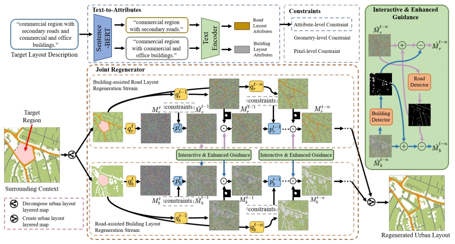

# Text2City

Code and dataset for the paper "Text2City: One-Stage Text-Driven Urban Layout Regeneration"

Regenerating urban layout is an essential process for urban regeneration. In this paper, we propose a new task called text-driven urban layout regeneration, which provides an intuitive input modal - text - for users to specify the regeneration, instead of designing complex rules. Given the target region to be regenerated, we propose a one-stage text-driven urban layout regeneration model, Text2City, to jointly and progressively regenerate the urban layout (i.e., road and building layouts) based on textual layout descriptions and surrounding context (i.e., urban layouts and functions of the surrounding regions). Text2City first extracts road and building attributes from the textual layout description to guide the regeneration. It includes a novel one-stage joint regenerator network based on the conditioned denoising diffusion probabilistic models (DDPMs) and prior knowledge exchange. To harmonize the regenerated layouts through joint optimization, we propose the interactive & enhanced guidance module for self-enhancement and prior knowledge exchange between road and building layouts during the regeneration. We also design a series of constraints from attribute-, geometry- and pixel-levels to ensure rational urban layout generation. To train our model, we build a large-scale dataset containing urban layouts and layout descriptions, covering 147K regions. Qualitative and quantitative evaluations show that our proposed method outperforms the baseline methods in regenerating desirable urban layouts that meet the textual descriptions.

## Requirements

python 3.8.0

torch 1.12.0

opencv 4.6.0

numpy 1.22.3

## Usage

Our dataset contains rich annotations, including urban fucntion, urban road layout, urban building layout and descriptions of each region.

Our dataset can be downloaded from the [link](https://drive.google.com/drive/folders/185l3C2xx-txjh2d3_EmGFKpBZCCcBHrE?usp=sharing).

The pre-process of our dataset is shown in ***create_dtaset.py***

### Step1 Urban layout description guidance

Text2City utilizes urban layout descriptions to generate urban layouts. We selected CLIP as the feautre extraction model and fine-tuned the [official model](https://github.com/openai/CLIP).

### Step 2 Urban layout regeneration

The regeneration model is based on [guided diffusion](https://github.com/openai/guided-diffusion) model. Please download the '[256x256_diffusion_uncond.pt](https://openaipublic.blob.core.windows.net/diffusion/jul-2021/256x256_diffusion_uncond.pt)' and put it under 'checkpoints' folder.

Please change the parameters in arguments.py to suit your test data.

Then, run the ***main.py*** using ***inference_one()*** fucntion to obtain the results.

python train.py

If you have any questions, please feel free to contact us.
